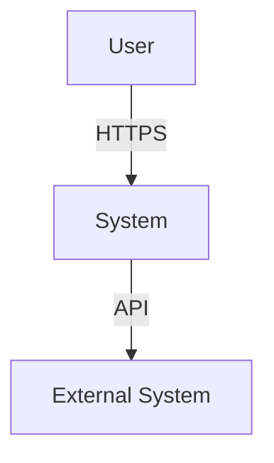
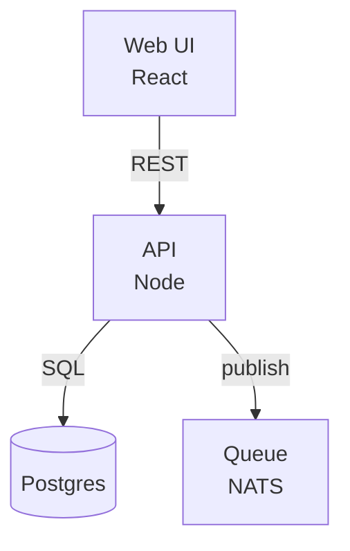
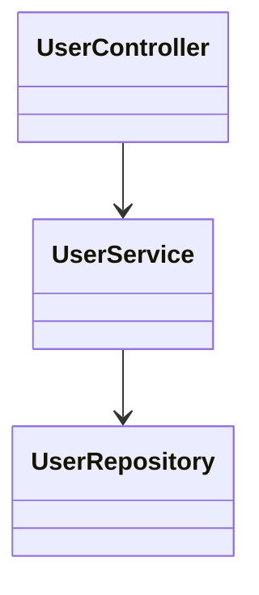

# Architecture Designer

## When to Use

- Proposing a new system or subsystem
- Evaluating an architectural change
- Reviewing alignment with existing platform
- Producing C4 diagrams

## Triggers

architecture, system design, c4, component, boundary, integration, scalability, coupling, cohesion, layering, hexagonal, clean architecture, ddd, bounded context, event-driven, sync vs async

## Core Workflow

1. **Frame the problem** — domain, constraints, NFRs (latency, throughput, availability, cost, compliance).
2. **Survey current state** — existing services, contracts, data flows. Cite with `file_path:line_number`.
3. **Identify drivers** — what's pushing this change?
4. **Generate options** — at least 2, ideally 3.
5. **Score against drivers** — explicit trade-off table.
6. **Decide** — write ADR via `adr-writer` skill.
7. **Diagram** — Mermaid C4 (Context → Container → Component as needed).

## C4 Levels (Mermaid)

### System Context


### Container


### Component (per container)


## Design Heuristics

| Heuristic | When |
|---|---|
| **Sync** | Low latency required, simple flow, immediate response |
| **Async / event-driven** | Decoupling, retry-ability, fan-out, eventual consistency OK |
| **Sync + async** | Command/query split (CQRS-lite) |
| **Shared DB** | Same bounded context only |
| **Service-per-DB** | Cross-boundary; integrate via APIs/events |
| **Strangler fig** | Migrating from monolith |
| **API Gateway** | >3 client types; cross-cutting concerns (authz, rate limit) |

## Common Pitfalls

- Designing for scale you don't have.
- Microservices before the monolith hurts.
- Shared DB across bounded contexts.
- Synchronous chains > 3 services deep.
- No idempotency on retried operations.
- No backpressure on producers.
- New tech for resume value, not for need.

## NFR Checklist

For any design, answer:

- **Latency**: p50, p95, p99 budget per hop.
- **Throughput**: peak RPS / events/sec.
- **Availability**: target SLO; what happens when downstream fails?
- **Consistency**: strong vs eventual; staleness budget.
- **Durability**: RPO/RTO if storage involved.
- **Cost**: $/month at expected scale.
- **Security**: trust boundaries; authn/authz at each.
- **Operability**: observable? On-call runbook?

## Output Template

```
## Problem
<concise>

## Current State
<cited refs>

## Drivers
- <ordered by priority>

## Options
| Option | Pros | Cons | NFR fit |

## Recommendation
We recommend <Option X> because <tie to drivers>.

## Diagram
<Mermaid C4>

## Open Questions
<for LT / user>
```

## References

- C4 Model: https://c4model.com
- Fundamentals of Software Architecture (Richards & Ford)
- Domain-Driven Design (Evans)
- Building Microservices (Newman)
